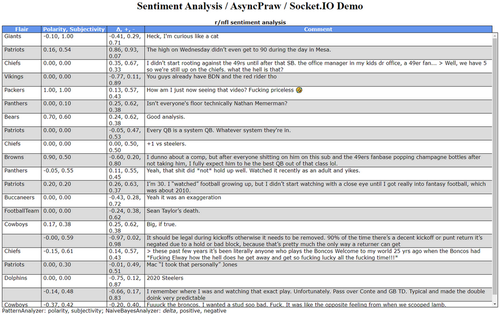

# NFL Sentiment Analysis
Sentiment Analysis of [r/nfl](https://www.reddit.com/r/nfl/) live-streamed comments

## Intro
This program uses the Reddit API to receive r/nfl comments in real time.  It then performs sentiment analysis on each user comment.  Results are then emitted from the server back to the web browser via the socket.io JS / Python library. A [Reddit API account](https://www.reddit.com/dev/api/) is needed in order to fetch the user comments.

This is just an experiment to learn more about:

* [socket.io](https://socket.io/) - for both JS and Python versions
* The [Asynchronous Python Reddit API Wrapper](https://github.com/praw-dev/asyncpraw)
* The [TextBlob: Simplified Text Processing](https://textblob.readthedocs.io/) library to perform [Sentiment Analysis](https://en.wikipedia.org/wiki/Sentiment_analysis)
* The [Uvicorn](https://www.uvicorn.org/) ASGI server
* The Python 3 [async / await](https://docs.python.org/3/library/asyncio-task.html) library

## Output
* 

## Prerequisites
* Install a recent version of Python 3.
* Python 3.9.5 was used for development.
* Install git, if not already installed.

## Installation and Operation
```
# clone this repository to your system
git clone https://github.com/jftuga/nfl_sentiment_analysis

# create a Python virtual environment
python -m venv nfl_sentiment_analysis
cd nfl_sentiment_analysis

# Active the virtual environment
- windows:
.\Scripts\Activate
- linux or macOS:
source bin/activate

# install the necessary Python dependencies inside the Python virtual environment
pip install -r requirements.txt

# start the app server
- windows:
.\start_server.ps1
- linux or macOS:
./start_server.sh

# open web browser to:
http://127.0.0.1:8000/

# you many need to wait a minute for comments to start appearing in the HTML table
```
